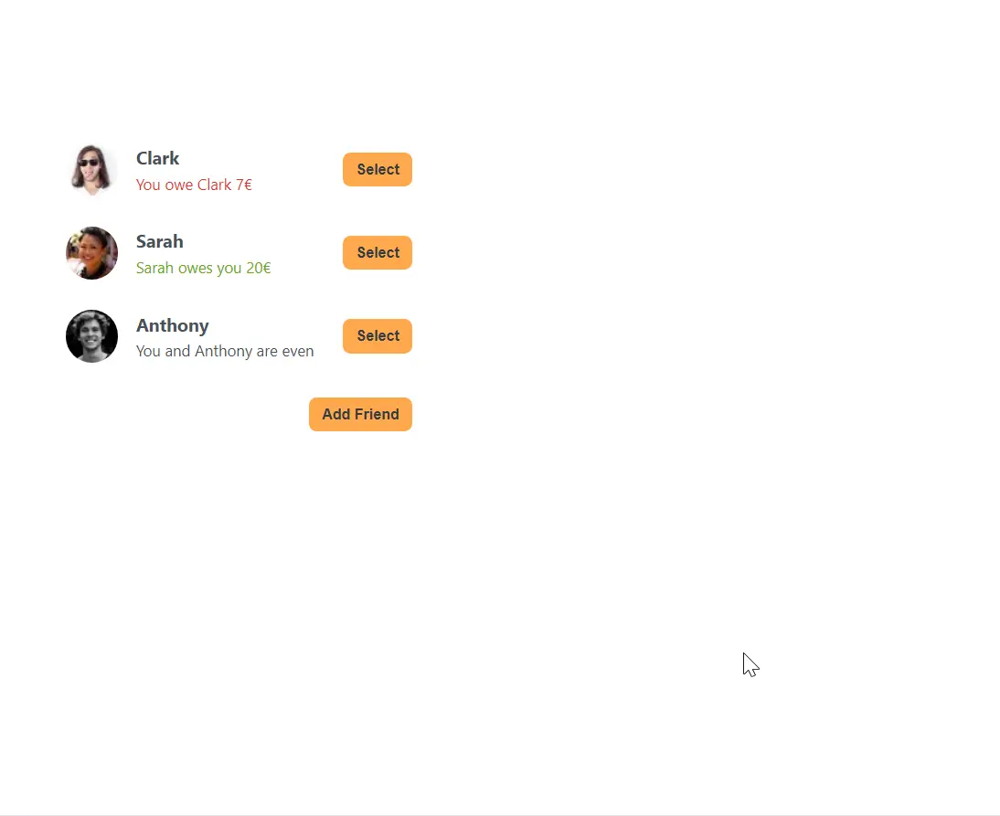

### 👋 **I am Erhan ERTEM**

&emsp;

## Udemy The Ultimate React Course 2024: React, Redux & More by Jonas Schmedtmann

### **Objective:** Cretae a Eat-n-Split App

-  Explore React state management, uplifting, state types
-  Explore propping
-  The way app contemplated in the course had a flawed logic @ split a bill
   pane. In order to address the grift input field relations, a few conditional
   clauses were setup to trigger state changes based on some entry conditions.

&emsp;

#### [Eat-n-Split App](https://app-eatnsplit-erhan-ertem.netlify.app/)

---

